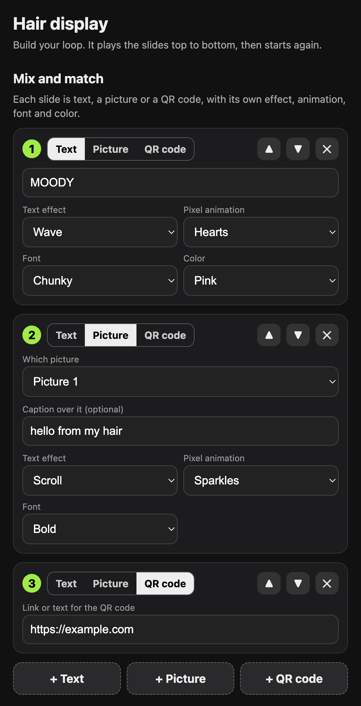
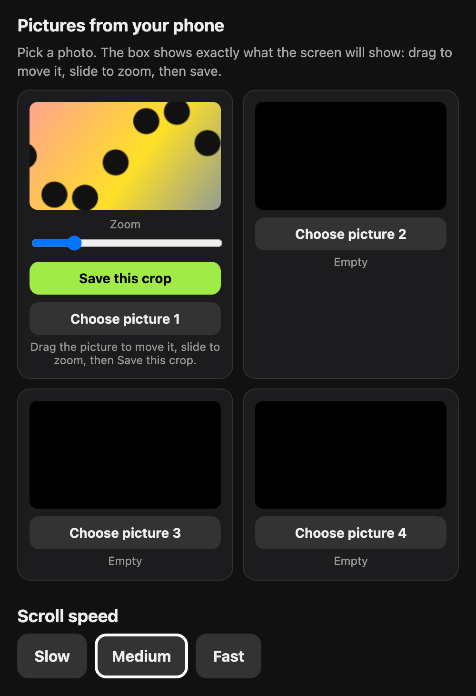

# Moody HQ

A tiny wearable pixel display. It runs on a LilyGO T-Display (ESP32, 1.14" 240x135 color screen) with a
small LiPo battery, and plays a loop of slides you build from your phone: text with effects, pixel
animations that react to the text, pictures from your camera roll, and QR codes.

No app and no cloud. Hold a button and the board makes its own Wi-Fi network; join it and the editor
opens in your phone's browser.

<p>
  
  
</p>

## Features

- **Slides.** Up to 10, played top to bottom in a loop. Each slide is text, a picture, or a QR code.
- **Text effects.** Scroll, wave, rainbow, bounce, typewriter, blink, glitch.
- **Pixel animations that know where the text is.** Hearts rise from the letters, rain splashes on them,
  snow settles and rides along, fire grows under them, a chomper eats them as they scroll in, a ball
  bounces along their tops, plus sparkles and confetti.
- **Pictures from your phone.** Four slots. The preview box is the screen: drag to move, slide to zoom,
  save. Add an optional caption on top.
- **QR codes.** Type a link or any text.
- **Fonts and colors.** Seven fonts, six color themes, three scroll speeds, set per slide.
- **Battery friendly.** Wi-Fi is off unless you are editing. Hold a button for deep sleep.
- **Everything is stored on the board** and survives power-off.

## Hardware

| Part | Notes |
|---|---|
| LilyGO / TTGO T-Display (ESP32, 1.14" ST7789, 240x135) | The V1.1 board with two buttons and USB-C. Sold under several brand names. |
| 3.7 V LiPo battery with a JST 1.25 mm 2-pin plug | Around 300-400 mAh and 4 mm thick fits behind the board. |
| USB-A to USB-C **data** cable | See [Troubleshooting](#troubleshooting) about USB-C to USB-C. |
| Something to mount it on | A hair clip, a pin back, a magnet. |

### Check the battery polarity first

> **A battery plugged in backwards can destroy the board.** JST 1.25 batteries are not wired to one
> standard, and many are the reverse of what this board expects.

The board ships with a short loose cable: the same white plug with a red and a black wire. Lay that
plug next to your battery's plug, both the same way up.

- Red on the same side on both: the battery is wired correctly. Plug it in.
- Red on opposite sides: the battery is reversed. Do not plug it in.

To fix a reversed battery, cut its plug off **one wire at a time** (never let the two bare battery
wires touch), then join red to red and black to black onto the loose cable that came with the board,
and insulate each join separately. Plug that cable into the board.

## Software setup

You need [`arduino-cli`](https://arduino.github.io/arduino-cli/) (or the Arduino IDE).

```bash
brew install arduino-cli          # macOS; see the arduino-cli docs for other systems

arduino-cli config init
arduino-cli config add board_manager.additional_urls https://espressif.github.io/arduino-esp32/package_esp32_index.json
arduino-cli core update-index
arduino-cli core install esp32:esp32@2.0.17
arduino-cli lib install "TFT_eSPI@2.5.43"
```

Use ESP32 core **2.0.17**. TFT_eSPI 2.5.43 has problems with the 3.x cores.

### Point TFT_eSPI at this board

TFT_eSPI is configured by editing a file inside the library. Open
`Arduino/libraries/TFT_eSPI/User_Setup_Select.h` and:

1. Comment out the default line: `// #include <User_Setup.h>`
2. Uncomment the T-Display line: `#include <User_Setups/Setup25_TTGO_T_Display.h>`

### Set your Wi-Fi name and password

```bash
git clone https://github.com/kennygeiler/moody-hq.git
cd moody-hq
cp hair_display/secrets.example.h hair_display/secrets.h
```

Edit `hair_display/secrets.h`. This is the network the display creates in edit mode. The password must
be at least 8 characters. `secrets.h` is ignored by git.

## Build and flash

```bash
arduino-cli board list                                   # find the port, e.g. /dev/cu.usbserial-XXXX

arduino-cli compile --fqbn esp32:esp32:esp32 hair_display
arduino-cli upload  --fqbn esp32:esp32:esp32:UploadSpeed=115200 -p <port> hair_display
```

The screen should start scrolling `hi :)`.

## Using it

| Button | Action |
|---|---|
| Right, tap | Next slide |
| Right, hold 2 seconds | Edit mode (Wi-Fi on) |
| Left, hold 2 seconds | Off (deep sleep). Tap right to wake. |

### Editing from your phone

1. Hold the right button for 2 seconds. The screen shows the Wi-Fi name and password.
2. Join that network on your phone. It will say it has no internet; that is expected.
3. The editor usually opens by itself. If it does not, open a browser and go to `http://192.168.4.1`.
4. Build your slides, then tap **Save and play**. Wi-Fi turns off and the loop starts.

Edit mode also ends if you tap the right button or leave it idle for 5 minutes.

**Slides.** Use **+ Text**, **+ Picture** or **+ QR code** to add one. The arrows reorder, the cross
removes. Each slide has its own text effect, pixel animation, font and color.

**Pictures.** Tap **Choose picture**, pick a photo, then drag it inside the preview box and use the zoom
slider until the box shows what you want. Tap **Save this crop**. The picture is stored on the board
immediately, separately from **Save and play**. Then add a Picture slide and choose which slot to show.

**Text.** Plain letters, numbers and punctuation only. Smart quotes from phone keyboards are converted;
emoji and accented characters are dropped.

## Assembly

One arrangement that works, front to back:

```
board (screen facing out)
electrical tape over the back of the board (leave the battery socket open)
foam tape
battery (lengthwise, wires toward the socket)
a stiff strip or plate (thin acrylic, or a piece of a plastic card)
clip, glued to the strip
```

- Glue the clip to the stiff strip, not to the battery. Opening a clip levers against whatever it is
  glued to, and a LiPo pouch must not be flexed, dented or punctured.
- Keep glue off the battery's wire end and off any wire joins.
- A flexible adhesive such as E6000 can be peeled later; avoid super glue and hot glue on the battery.
- Leave the USB port and both buttons reachable.
- Clear heat-shrink tubing (about 30 mm flat width) over the board and battery gives a tidier finish.

## How it works

- **One sketch:** [`hair_display/hair_display.ino`](hair_display/hair_display.ino). Each frame is drawn
  into an off-screen 240x135 sprite and pushed to the screen.
- **Slides** are stored with `Preferences` (namespace `hair`, key `slides`), one per line:
  `kind|effect|animation|font|color|picture|text`.
- **Pictures** are cropped and converted in the phone's browser to raw 240x135 RGB565 (high byte first)
  and uploaded as 64,800 bytes each. They live in LittleFS as `/img0.bin` to `/img3.bin`.
- **The editor** is a single HTML page embedded in the sketch, served by a captive portal
  (`WebServer` + `DNSServer`) on the board's own access point.
- **Memory.** The ESP32 has no spare RAM once Wi-Fi is on, so the page is streamed from flash in
  pieces instead of being built as one string, and the picture buffer is released during edit mode.
- **QR codes** use Richard Moore's [QRCode](https://github.com/ricmoo/QRCode) library (MIT), included
  as `rm_qrcode.c` / `rm_qrcode.h`. It is copied into the sketch folder because the ESP32 core ships a
  different header also named `qrcode.h`.

### Adding your own

- **Text effect:** add a name to `FX_NAMES` and the `FX_` enum, then handle it in `drawFx()`.
- **Animation:** add a name to `AN_NAMES` and the `AN_` enum, then handle it in `drawAnim()`, which is
  given the text's position each frame.
- **Font:** add a row to `FONTS`. Any built-in TFT_eSPI font or bundled GFX free font works.
- **Color theme:** add a row to `THEMES`.

The editor reads these lists from the board, so new entries appear in the dropdowns automatically.

## Troubleshooting

| Problem | Fix |
|---|---|
| The computer does not see the board | Use a USB-A to USB-C data cable, through a hub if your computer only has USB-C. USB-C to USB-C often does not work with this board, and some cables are charge-only. |
| Upload fails with `Invalid head of packet` | Upload at 115200 (`UploadSpeed=115200`), as in the command above. |
| The editor does not pop up | Open `http://192.168.4.1` in a browser, with the `http://`. |
| The browser cannot reach `192.168.4.1` | Check the screen still says EDIT MODE. Turn off mobile data, VPN and private relay for a moment; phones often route around a Wi-Fi network that has no internet. |
| Nothing happens on battery | Check polarity (see above) and that the plug is fully seated. |
| Picture slide says "No picture yet" | Save a crop into that slot first. |
| Screen is blank or garbled after flashing | TFT_eSPI is not set to `Setup25_TTGO_T_Display.h`. |

Older versions of the sketch are kept in [`archive/`](archive/).
